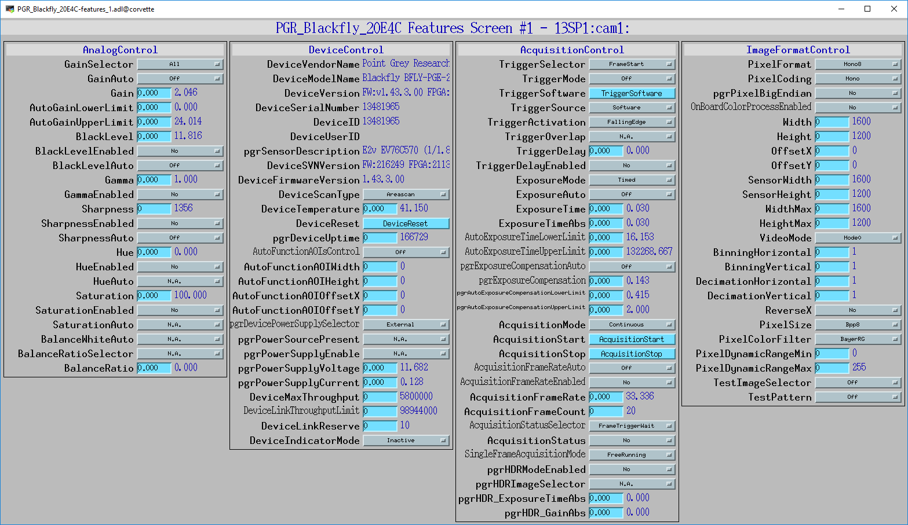
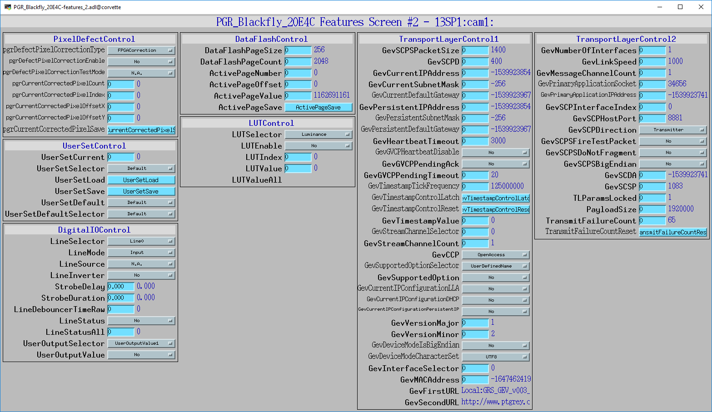
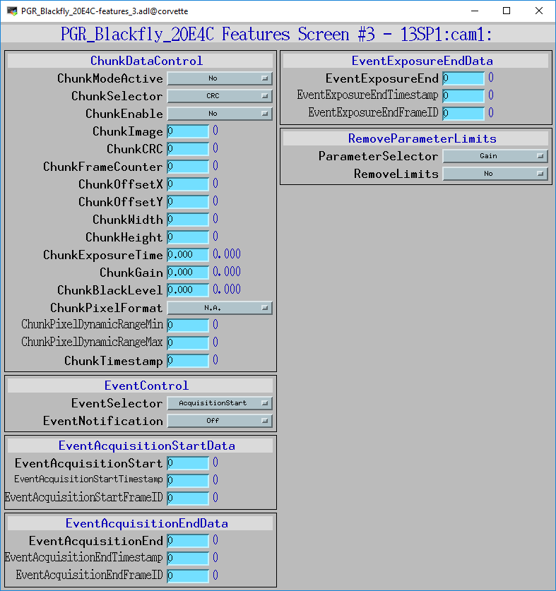

======================================
areaDetector GenICam base class driver
======================================

:author: Mark Rivers, University of Chicago

.. contents:: Contents

Overview
--------

This is an :doc:`../index` base class driver for GenICam cameras.

`GenICam <https://www.emva.org/standards-technology/genicam/>`_ is a 
Generic Interface for Cameras from the European Machine Vision Association (EMVA). 
The stated goal of GenICam is:

  The goal of GenICam (Generic Interface for Cameras) is to provide a generic programming interface for 
  all kinds of devices (mainly cameras), no matter what interface technology (GigE Vision, USB3 Vision, CoaXPress, 
  Camera Link HS, Camera Link etc.) they are using or what features they are implementing. 
  The result is that the application programming interface (API) will be identical regardless 
  of interface technology.

GenICam supports the following interface standards:

- GigE Vision 
- USB3 Vision
- Camera Link
- Camera Link HS
- IIDC2 (Firewire)

GenICam cameras are controlled via "features" such as ExposureTime, Gain, TriggerMode, etc.  Each feature has a
name, data type, flags indicating whether it can be read or written, etc.
Many features are defined in the GenICam specification, and vendors must use these names
for those features.  Vendors are also free to add new features that are specific to their cameras.

All GenICam cameras contain an XML file that provides a complete description of all of the features available
in that camera. ADGenICam provides Python scripts that read and parse the XML file and automatically produce
the EPICS database (.template) file and medm display (.adl) files.  These medm files can then be autoconverted
to edm, CSS-Boy, and caQtDM files.

This is a small snippet from an XML file for the feature called PixelFormat::

  <Enumeration Name="PixelFormat" NameSpace="Standard">
    <ToolTip>Format of the pixel data.</ToolTip>
    <Description>Format of the pixel data.</Description>
    <DisplayName>Pixel Format</DisplayName>
    <Visibility> Beginner</Visibility>
    <pIsLocked>TLParamsLocked</pIsLocked>
    <ImposedAccessMode>RW</ImposedAccessMode>
    <EnumEntry Name="Mono8" NameSpace="Standard">
      <ToolTip>Pixel format set to Mono 8.</ToolTip>
      <Description>Pixel format set to Mono 8.</Description>
      <DisplayName>Mono 8</DisplayName>
      <pIsImplemented>Mono8Inq_Reg</pIsImplemented>
      <Value>0x01080001</Value>
    </EnumEntry>

ADGenICam and aravis
--------------------
A problem with the GenICam standard is that while they provide a reference implementation, it is not
open-source.  Source code derived from the reference implementation cannot be freely distributed.

One solution to this is the `aravis project <https://github.com/AravisProject/aravis>`_, which is
a reverse-engineered library and utilities for GenICam cameras available only on Linux.
areaDetector has long had an `aravisGigE driver <https://github.com/areaDetector/aravisGigE>`_ based
on aravis.  Although it is called aravisGigE the driver actually supports USB cameras as well as
GigE and 10 GigE cameras.  

There is a new `ADAravis driver <https://github.com/areaDetector/ADAravis>`_.  This driver also uses
aravis, but it differs from aravisGigE by using this ADGenICam base class to significantly reduce the amount of code.
Many of the ideas in ADGenICam were borrowed from aravisGigE.

aravisGigE builds the aravis package in its vendor/ directory.  You can also build aravis outside of
areaDetector, for example in /usr/local.  aravis may be added to `ADSupport <https://github.com/areaDetector/ADSupport>`_
in the future.

Reading the XML file from the camera
------------------------------------
To use the ADGenICam driver it is first necessary to download the XML file from the camera.
To my knowledge the only code available to download the XML file from any GenICam camera
is the **arv-tool** program that is included in the aravis package.  This means that the aravis
package is required to create the XML file, and so the camera must be available from a Linux
system at least once initially.

However, if using the `ADSpinnaker driver <https://github.com/areaDetector/ADSpinnaker>`_ or the
`ADVimba driver <https://github.com/areaDetector/ADVimba>`_ aravis is not needed to build the
driver or at run-time.

To extract the XML file from the camera do the following:

- Run the arv-tool program to make a list of all the GenICam cameras that are visible from the
  Linux system, for example:
  
::

TahoeU18:/corvette/home/epics/devel/areaDetector/ADGenICam> ../aravisGigE/bin/linux-x86_64/arv-tool-0.6
Allied Vision Technologies-02-2142A-06178 (164.54.160.58)
Allied Vision Technologies-02-2604A-07008 (164.54.160.104)
Allied Vision Technologies-50-0503317598 (164.54.160.62)
Allied Vision Technologies-50-0503419258 (164.54.160.21)
FLIR-18011754 (192.168.0.2)
PointGrey-13481965 (164.54.160.114)

- Download the XML file with the command `arv-tool -n cameraName genicam > XML_file_name`.

::

TahoeU18:/corvette/home/epics/devel/areaDetector/ADGenICam> ../aravisGigE/bin/linux-x86_64/arv-tool-0.6 -n PointGrey-13481965 genicam > xml/PGR_Blackfly_20E4C.xml
TahoeU18:/corvette/home/epics/devel/areaDetector/ADGenICam> ls -ltr xml
total 1780
-rw-rw-r-- 1 epics domain users 332287 Oct  7  2018 PGR_Blackfly_50S5C.xml
-rw-rw-r-- 1 epics domain users 231493 Oct 29  2018 AVT_Manta_G507C.xml
-rw-r--r-- 1 epics domain users 932059 May 31 10:16 FLIR_ORX_10G_51S5.xml
-rw-r--r-- 1 epics domain users 317859 Jun  2 09:17 PGR_Blackfly_20E4C.xml

Python script to create EPICS database
--------------------------------------

Python script to create medm screens
------------------------------------

ADGenICam Classes
-----------------
ADGenICam provides three classes that are used by derived classes for real cameras.

GenICamFeature class
====================
This class defines a GenICam feature and associates it with an asyn parameter.  
Real drivers must define a class derived from ADGenICam that implements
a number of pure virtual functions, for example to write/read features to/from the camera.  
This is the complete list of all pure virtual functions that the derived class must implement::

    // These are the pure virtual functions that derived classes must implement
    virtual bool isImplemented(void) = 0;
    virtual bool isAvailable(void) = 0;
    virtual bool isReadable(void) = 0;
    virtual bool isWritable(void) = 0;
    virtual int readInteger(void) = 0;
    virtual int readIntegerMin(void) = 0;
    virtual int readIntegerMax(void) = 0;
    virtual int readIncrement(void) = 0;
    virtual void writeInteger(int value) = 0;
    virtual bool readBoolean(void) = 0;
    virtual void writeBoolean (bool value) = 0;
    virtual double readDouble(void) = 0;
    virtual double readDoubleMin(void) = 0;
    virtual double readDoubleMax(void) = 0;
    virtual void writeDouble(double value) = 0;
    virtual int readEnumIndex(void) = 0;
    virtual void writeEnumIndex(int value) = 0;
    virtual std::string readEnumString(void) = 0;
    virtual void writeEnumString(std::string const & value) = 0;
    virtual void readEnumChoices(std::vector<std::string>& enumStrings, std::vector<int>& enumValues) = 0;
    virtual std::string readString(void) = 0;
    virtual void writeString(std::string const & value) = 0;
    virtual void writeCommand(void) = 0;

This class includes the following properties::

    std::string mAsynName;        // asyn parameter name
    asynParamType mAsynType;      // asyn parameter type
    int mAsynIndex;               // asyn parameter index
    std::string mFeatureName;     // GenICam feature name
    GCFeatureType_t mFeatureType; // GenICam feature type

The class contains methods to convert the units used by EPICS drivers to/from those used by
GenICam.  These conversions currently include:

- GenICam **ExposureTime**, **ExposureTimeAbs**, and **TriggerDelay** features: EPICS uses seconds, GenICam uses microseconds
- EPICS **AcquirePeriod**: EPICS uses period in seconds, GenICam uses frame rate in Hz
- EPICS **ImageMode**: EPICS uses [Single, Multiple, Continuous] enums, GenICam uses [Continuous, SingleFrame, Multiframe],
  and we want to use the EPICS values.
 
The class contains methods to write the features value to the camera, and to read the current value of the
feature from the camera.
 
ADGenICamFeatureSet
===================
This class is a collection of all of the GenICamFeature objects for the camera, implemented as a C++ std::multiset.
It provides methods to insert and find the GenICamFeature objects, to read all of the feature values from the camera,
and to print a report of all of the feature attributes and values.  This report() method is called when asynReport is
called for the owner ADGenICam class.

ADGenICam class
===============
This is the base class from which the actual camera driver will derive.  ADGenICam inherits from :doc:`../ADCore/ADDriver`.

It contains the following methods:

- **createFeature()** This is a pure virtual method that the derived class must implement.  It creates a detector-specific
  feature object derived from GenICamFeature.
- **drvUserCreate()** This is the method that is called when EPICS base is initialize the records during iocInit.
  Most areaDetector drivers do not implement this method.  This is because they create their detector-specific parameters
  in their constructor, and the asynPortDriver base class implements **drvUserCreate**.  
  ADGenICam is different.  It creates the detector-specific parameters dynamically as the database file created by
  the Python script described above is read in during iocInit.  For each GenICam feature that is passed in the drvUser
  argument to this function it calls createFeature() described above.
- **addADDriverFeatures()**  This function creates GenICam features for all of the standard ADDriver parameters that map to GenICam
  features.  This allows the standard records such as ADManufacturer, ADModel, ADMaxSizeX, ADMaxSizeY, etc. to get their values
  with no feature-specific code in this class or the derived class.
- **writeInt32()** This function handles writes to integer parameters.  If the parameter is associated with a GenICam feature
  then it writes the value to the camera.
  Because writing to one feature can affect the values of other features, the values of all GenICam features are read back after
  the write is complete.  This includes the enum strings and values for all enum features, since these may have changed as well.
- **writeFloat64()** This function handles writes to double precision parameters.  If the parameter is associated with a GenICam feature
  then it writes the value to the camera.
  Because writing to one feature can affect the values of other features, the values of all GenICam features are read back after
  the write is complete.  This includes the enum strings and values for all enum features, since these may have changed as well.
- **readEnum()** This reads the enum strings associated with a parameter.  If the parameter is associated with a GenICam feature
  then it reads the enum strings and values for that feature, so EPICS bo/bi/mbbo/mbbi record enum choices are constructed 
  at run-time with the choices the camera actually supports.  This function is called at iocInit for all enum features.
  These enum choices can also change at run-time as explained above, and this class does callbacks to device support with 
  the new choices.
- **startCapture()** This is a pure virtual function that the derived class must implement to start the camera acquisition.
- **stopCapture()**  This is a pure virtual function that the derived class must implement to stop the camera acquisition.

MEDM screens
------------
The following is the MEDM screen ADGenICam.adl when controlling a Point Grey Blackfly BFLY-PGE-20E4C camera.
This screen is generic and can be used for any GemICam camera.

.. figure:: ADGenICam.png
    :align: center

The following is the MEDM screen PGR_Blackyfly_20E4C-features1.adl when controlling a Point Grey Blackfly BFLY-PGE-20E4C camera.
This screen was autogenerated by the Python script described above, and is specific to this camera model.
It is loaded from the "Camera-specific features" related display widget in the above screen.

The following are the additional two feature screens generated by the Python program described above.
The number of camera specific screens generated is determined by the number of features in a specific camera
and by the maximum screen size specified in the Python program.

